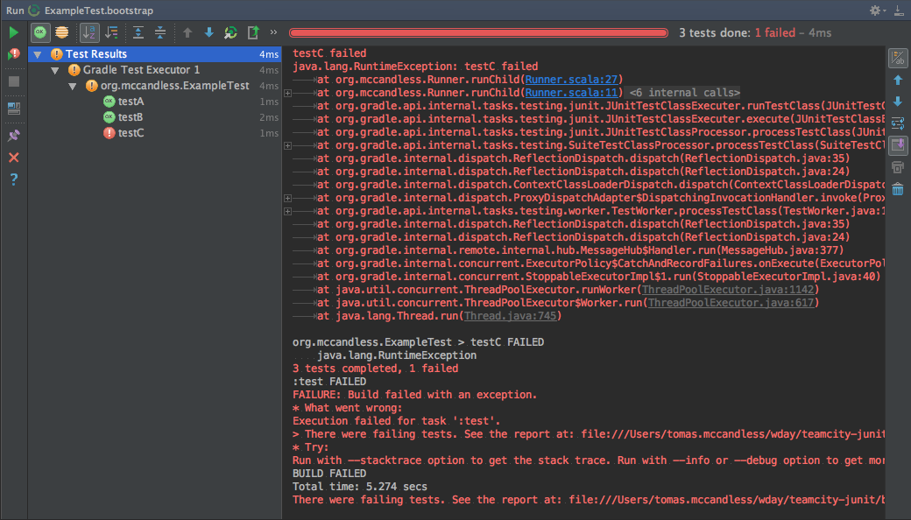
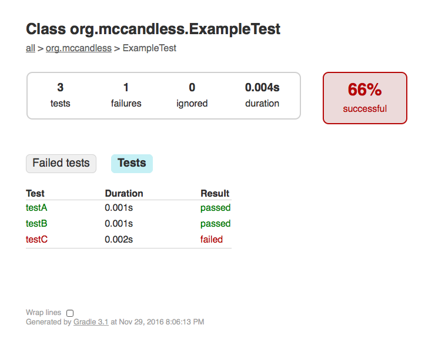
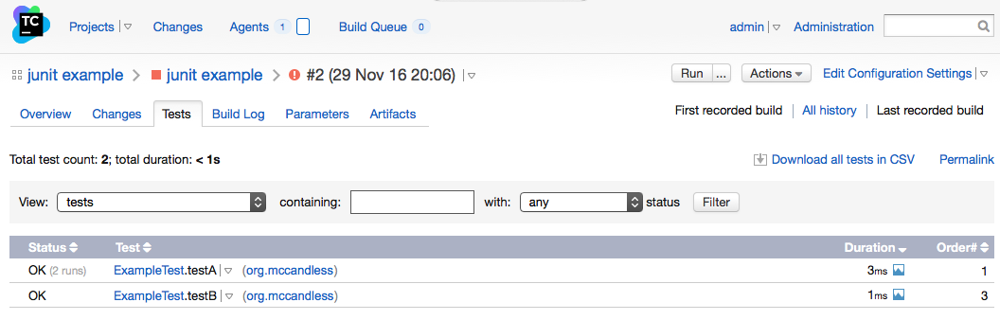

# teamcity-junit
We have a framework that performs monitoring of some dynamically generated JUnit tests. One component of this is a custom JUnit runner
that notifies JUnit about test status. Certain interleavings of test notification events, such as the following, are incorrectly
interpreted by TeamCity:

- begin test A
- begin test B
- end test A
- begin test C
- end test B
- end test C (C threw an exception)

Included here is a small example that simulates this potential interleaving. See `Runner.scala` and `ExampleTest.scala`.

When run from IntelliJ, this is correctly interpreted as 3 distinct tests with 1 failure:


<br><br>

Gradle also correctly interprets this as 3 distinct tests with 1 failure:


<br><br>

However, TeamCity interprets this as 2 successful executions of A, and 1 successful execution of B. C is not recognized at all:


<br><br>

I have included a docker-compose file with containers for TeamCity server and agent. I am using docker version 1.12.3 on OS X 10.11.4.
Both images (server and agent) are using TeamCity version 10.0.3.
Both containers can be started by cloning this repo
and running the following commands:
```
cd docker
docker-compose up
```
The login credentials for TeamCity are admin/admin. I have configured the server to mount the code in this repo as a vcs root from the
local file system. Once the server is up, build results for a build exhibiting this problem can be seen
[here](http://localhost:8111/viewLog.html?buildId=2&tab=buildResultsDiv&buildTypeId=JunitExample_JunitExample)

<br>

Gradle correctly detects that `testC` failed, and failed the build, but TeamCity is incorrectly displaying results as 2 successful 
executions of `testA` and 1 successful execution of `testB`. As far as TeamCity is concerned, there was no execution of `testC`, 
and all executed tests were successful.

The Gradle and JUnit reports are both available as artifacts from that build. The Gradle HTML report is 
[here](http://localhost:8111/repository/download/JunitExample_JunitExample/2:id/build/reports/tests/test/index.html), and 
the JUnit XML report is 
[here](http://localhost:8111/repository/download/JunitExample_JunitExample/2:id/build/test-results/test/TEST-org.mccandless.ExampleTest.xml)

I have opened a ticket with jetbrains https://youtrack.jetbrains.com/issue/TW-47953
